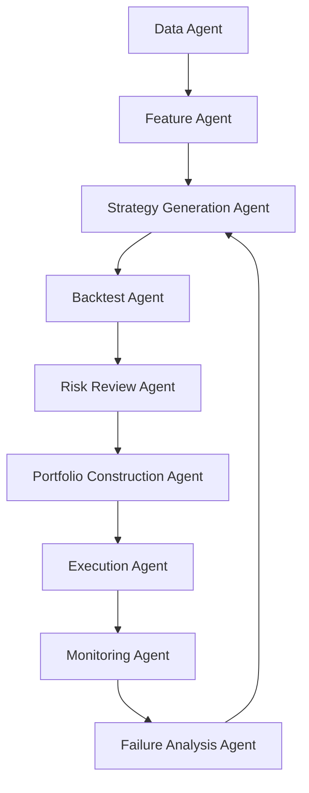

# AI Agent / 자동화 중심 기능 추천 정리

이 문서는 `develop-plans/trading-strategies` 아래의 전략 문서들을 기준으로, `TradingAPP`를 사람의 의사결정 보조 툴이 아니라 `AI algorithm / AI agent 기반 자동화 플랫폼`으로 만들기 위해 어떤 기능을 우선 구현하면 좋은지 정리한 설계 메모다.

초점은 "개인투자자가 화면에서 직접 클릭하며 판단하는 기능"이 아니라 아래 질문에 있다.

- 어떤 에이전트가 어떤 데이터를 읽고 어떤 판단을 내려야 하는가
- 전략별로 어떤 자동화 파이프라인을 만들 수 있는가
- 여러 전략 에이전트를 어떻게 조합해야 실제 자동매매나 자동 리밸런싱에 가까워지는가
- AI가 전략을 생성하고 실행할 때 어떤 안전장치가 반드시 필요한가

이 문서의 전제는 단순 챗봇이 아니라, `지속적으로 시장을 감시하고`, `전략을 제안하고`, `검증하고`, `포트폴리오를 조정하고`, `실패를 감시하는` 반자동 또는 자동 에이전트 시스템이다.

---

## 1. 핵심 결론

`TradingAPP`에서 가장 가치 있는 자동화는 "AI가 종목을 추천해주는 기능"이 아니다. 진짜 가치가 큰 것은 아래 6개를 한 파이프라인으로 연결하는 것이다.

1. 데이터 수집과 정규화를 자동화한다.
2. 전략별 피처 계산과 점수화를 자동화한다.
3. 전략 가설 생성과 조합 생성을 자동화한다.
4. 백테스트와 워크포워드 검증을 자동화한다.
5. 리스크와 포트폴리오 제약을 반영한 실행 판단을 자동화한다.
6. 성과 저하, 레짐 변화, 데이터 이상을 감시하고 자동으로 전략을 중지하거나 교체한다.

즉, 제품의 중심은 `AI 종목 추천기`가 아니라 `Autonomous Research + Backtest + Execution Loop`가 되어야 한다.

---

## 2. 전략 문서에서 바로 뽑아낼 수 있는 에이전트 유형

현재 전략 문서군은 다음 다섯 축으로 나뉜다.

- `technical-analysis.md`
- `fundamental-analysis.md`
- `macroeconomics.md`
- `microeconomics.md`
- `econometrics.md`

이 다섯 축은 그대로 다섯 종류의 분석 에이전트로 변환할 수 있다.

### 2.1. Technical Signal Agent

- 역할:
  - 가격과 거래량 기반으로 진입/청산 신호를 만든다.
- 주로 쓰는 개념:
  - `Time-Series Momentum`
  - `Relative Strength`
  - `Dual Momentum`
  - `Donchian Breakout`
  - `SuperTrend`
  - `ATR Stop`
  - `Regime Filter`
- 출력:
  - 종목별 `long / flat / short`
  - 신호 강도 점수
  - 손절가와 포지션 크기 제안
- 자동화 가치:
  - 가장 빠르게 MVP를 만들 수 있다.
  - 실시간 또는 일간 자동 실행에 적합하다.

### 2.2. Fundamental Ranking Agent

- 역할:
  - 재무제표와 밸류에이션을 이용해 장기 보유 후보를 점수화한다.
- 주로 쓰는 개념:
  - `Value Score`
  - `Quality Score`
  - `Growth Score`
  - `Safety Score`
  - `Piotroski F-Score`
  - `Altman Z-Score`
  - `Accruals`
- 출력:
  - 종목별 종합 점수
  - 섹터 중립 랭킹
  - 탈락 사유
- 자동화 가치:
  - 인간이 가장 귀찮아하는 재무제표 비교를 자동화한다.
  - 월간/분기 리밸런싱 시스템에 매우 잘 맞는다.

### 2.3. Macro Regime Agent

- 역할:
  - 지금 시장이 어떤 국면인지 판단하고, 어떤 전략을 켜고 끌지 결정한다.
- 주로 쓰는 개념:
  - 성장/물가/금리/신용/환율 레짐
  - 경기 확장/둔화/침체/회복 분류
  - 장단기 금리차
  - 신용스프레드
  - 인플레이션 재가속 여부
- 출력:
  - `risk-on`, `neutral`, `risk-off`
  - 자산군 선호도
  - 전략 활성화/비활성화 플래그
- 자동화 가치:
  - 모든 전략이 항상 켜져 있으면 안 되는 문제를 해결한다.
  - 추세 전략과 가치 전략의 가중치를 시장 국면에 따라 바꿀 수 있다.

### 2.4. Micro Structure / Business Quality Agent

- 역할:
  - 기업의 가격결정력, 진입장벽, 산업 구조, 거버넌스 질을 해석한다.
- 주로 쓰는 개념:
  - 경쟁구조
  - 가격탄력성
  - 네트워크 효과
  - 플랫폼 경제학
  - 대리인 문제
  - 정보 비대칭
- 출력:
  - 질적 기업 점수
  - 산업 구조 점수
  - 경영진/거버넌스 리스크 플래그
- 자동화 가치:
  - 기본적 분석이 놓치기 쉬운 "숫자 밖의 구조적 질"을 보완한다.
  - 장기 투자 에이전트의 후보군 품질을 크게 높일 수 있다.

### 2.5. Econometric Portfolio & Risk Agent

- 역할:
  - 전략의 기대수익, 변동성, 상관관계, 팩터 노출, tail risk를 통합 관리한다.
- 주로 쓰는 개념:
  - CAPM / APT
  - alpha / beta
  - covariance
  - volatility targeting
  - VaR / ES
  - portfolio optimization
- 출력:
  - 전략별 리스크 기여도
  - 포트폴리오 가중치
  - 노출 제한 경고
- 자동화 가치:
  - 좋은 신호 여러 개를 합쳤다가 포트폴리오가 망가지는 문제를 막는다.
  - 진짜 자동화 시스템으로 가려면 반드시 필요하다.

---

## 3. 가장 먼저 만들어야 할 핵심 에이전트 기능

전략 문서 전체를 보면 기능 아이디어는 많지만, 자동화 목적이라면 아래 순서가 가장 현실적이다.

## 3.1. Strategy DSL Generator

- 설명:
  - AI가 전략을 자연어가 아니라 제한된 DSL로 생성하게 한다.
- 왜 중요한가:
  - LLM이 임의 코드나 애매한 문장을 내놓지 못하게 막을 수 있다.
  - 백테스트 엔진과 바로 연결된다.
- 예시 출력:

```json
{
  "universe": "KR-stocks-largecap",
  "entry": [
    { "indicator": "dual_momentum", "lookback": 120, "operator": "top_k", "value": 20 },
    { "indicator": "price_above_ema", "period": 200 }
  ],
  "exit": [
    { "indicator": "atr_stop", "multiple": 2.0 }
  ],
  "rebalance": "weekly"
}
```

- 연결 전략 문서:
  - 기술적 분석, 기본적 분석, 금융공학 전부

## 3.2. Strategy Composer Agent

- 설명:
  - 서로 다른 전략 축을 조합해 하나의 실행 가능한 전략 후보를 만든다.
- 예:
  - 기본적 분석으로 후보군 생성
  - 기술적 분석으로 진입 타이밍 결정
  - 거시 에이전트로 risk-on일 때만 활성화
  - 금융공학 에이전트로 가중치와 리스크 제한 적용
- 왜 중요한가:
  - 사용자가 원하는 것은 단일 지표가 아니라 "실제로 돌아가는 자동 전략"이다.

## 3.3. Auto Backtest & Walk-Forward Agent

- 설명:
  - AI가 만든 전략을 즉시 백테스트하고, 인샘플/OOS/워크포워드 검증까지 자동 수행한다.
- 왜 중요한가:
  - 자동화 시스템에서 가장 위험한 것은 근거 없는 전략 실행이다.
- 최소 출력:
  - CAGR
  - MDD
  - Sharpe
  - turnover
  - alpha / beta
  - OOS 성과
  - 파라미터 민감도

## 3.4. Risk Guardrail Agent

- 설명:
  - 전략이 아무리 좋아도 실행 가능한지 최종 승인하는 에이전트다.
- 체크 항목:
  - 종목 집중도
  - 섹터 집중도
  - 변동성 초과
  - 최대 손실 예상
  - liquidity filter
  - earnings / macro event proximity
- 왜 중요한가:
  - 이 에이전트가 없으면 시스템이 "수익률 높은 백테스트"에만 끌려간다.

## 3.5. Live Monitoring Agent

- 설명:
  - 장중 또는 일마감 후 현재 포지션과 전략 상태를 감시한다.
- 감시 대상:
  - stop loss breach
  - drawdown breach
  - factor drift
  - macro regime shift
  - data feed failure
- 왜 중요한가:
  - 자동매매의 핵심은 진입보다 "언제 끊을지"다.

## 3.6. Failure Analysis Agent

- 설명:
  - 성과가 나빠진 전략의 실패 원인을 자동 분석한다.
- 분석 대상:
  - 시장 레짐 변화
  - 거래비용 악화
  - 특정 팩터 붕괴
  - 종목군 편중
  - 데이터 누락
- 왜 중요한가:
  - 실패를 설명하지 못하면 전략은 계속 쌓이고 결국 통제가 안 된다.

---

## 4. 개인 자동화 목적에서 가장 유용한 실제 기능 추천

여기서부터는 "어떤 에이전트가 있으면 좋을까"가 아니라, 실제 앱 기능으로 만들었을 때 개인 투자 자동화에 바로 도움이 되는 항목들이다.

### 4.1. 자동 전략 생성기

- 기능:
  - 사용자가 목표를 입력하면 AI가 전략 DSL 초안을 여러 개 만든다.
- 입력 예시:
  - "미국 대형주에서 장기 추세 추종 전략"
  - "한국 중형주 중 퀄리티 + 모멘텀 조합"
  - "리스크 낮은 ETF 로테이션 전략"
- 출력 예시:
  - 5개 전략 초안
  - 각 전략의 가설 설명
  - 필요한 데이터
  - 리밸런싱 주기
  - 예상 리스크
- 우선순위:
  - 매우 높음

### 4.2. 자동 멀티전략 조합기

- 기능:
  - 기술적, 기본적, 거시, 계량 전략을 조합한 상위 전략을 자동 생성한다.
- 예:
  - `Fundamental candidate selection`
  - `Technical timing`
  - `Macro regime gating`
  - `Econometric risk budgeting`
- 왜 유용한가:
  - 사람이 손으로 조건을 이어붙이는 과정을 크게 줄인다.
- 우선순위:
  - 매우 높음

### 4.3. 자동 백테스트 배치 실행기

- 기능:
  - AI가 생성한 전략 후보들을 한 번에 수십~수백 개 테스트한다.
- 결과:
  - 상위 전략 자동 정렬
  - 과최적화 의심 전략 자동 제외
  - 거래비용 반영 성과 비교
- 왜 유용한가:
  - 자동화 목적에서는 한 전략을 정교하게 손보는 것보다 후보군 탐색 속도가 중요하다.
- 우선순위:
  - 매우 높음

### 4.4. 자동 전략 심사위원

- 기능:
  - 백테스트 결과를 보고 "이 전략을 채택해도 되는가"를 자동으로 평가한다.
- 심사 기준:
  - OOS 성과 유지 여부
  - MDD 허용 범위
  - turnover 과다 여부
  - 종목 수 과소 여부
  - 특정 연도 편중 여부
  - 벤치마크 대비 alpha 존재 여부
- 왜 유용한가:
  - 사람은 좋은 그래프에 쉽게 속는다.
- 우선순위:
  - 매우 높음

### 4.5. 자동 리밸런싱 에이전트

- 기능:
  - 매일, 매주, 매월 리밸런싱 규칙을 자동 수행한다.
- 입력:
  - 전략 점수
  - 리스크 한도
  - 포지션 제한
  - 현금 비중 규칙
- 출력:
  - 신규 편입
  - 비중 축소
  - 청산 후보
- 왜 유용한가:
  - 개인 투자자는 리밸런싱을 가장 자주 미루고, 그 결과 전략 일관성이 무너진다.
- 우선순위:
  - 높음

### 4.6. 자동 위험 감시 에이전트

- 기능:
  - 실시간 또는 일마감 기준으로 포트폴리오 리스크를 감시하고 조치한다.
- 조치 예시:
  - 신규 진입 중단
  - 비중 강제 축소
  - 현금 비중 상향
  - 특정 전략 일시 정지
- 감시 기준:
  - 일간 VaR 초과
  - 포트폴리오 변동성 초과
  - 종목 집중도 초과
  - 섹터 편중 초과
  - 이벤트 리스크 임박
- 우선순위:
  - 매우 높음

### 4.7. 레짐 전환 감시 에이전트

- 기능:
  - 거시지표와 시장 내부 데이터를 이용해 레짐 변화를 감지한다.
- 예:
  - risk-on -> neutral
  - neutral -> risk-off
  - 추세장 -> 횡보장
- 조치:
  - 활성 전략 교체
  - 포트폴리오 가중치 변경
  - 공격적 전략 정지
- 우선순위:
  - 높음

### 4.8. 팩터 노출 자동 분석기

- 기능:
  - 현재 포트폴리오가 실제로 어떤 팩터에 노출되어 있는지 자동 분석한다.
- 예:
  - 시장 베타 과다
  - 모멘텀 편중
  - 소형주 편중
  - 성장주 쏠림
- 왜 유용한가:
  - 전략 여러 개를 돌려도 결국 같은 팩터를 중복 보유하는 경우가 많다.
- 우선순위:
  - 높음

### 4.9. AI Research Memory

- 기능:
  - AI가 이전 전략 실험, 실패 사례, 잘 작동한 조건을 기억한다.
- 저장 대상:
  - 전략 DSL
  - 백테스트 결과
  - 실패 이유
  - 유효했던 시장 조건
- 왜 유용한가:
  - 자동화 시스템이 같은 실패를 반복하지 않게 해준다.
- 우선순위:
  - 높음

### 4.10. Auto Thesis Writer / Reporter

- 기능:
  - AI가 전략 생성 이유, 리스크, 최근 성과 변화, 교체 이유를 자동 문서화한다.
- 왜 유용한가:
  - 자동화가 고도화될수록 "왜 지금 이 전략이 돌고 있는가"를 추적하는 기능이 필요하다.
- 우선순위:
  - 중간

---

## 5. 전략 문서별로 만들면 좋은 에이전트 기능

## 5.1. Technical Analysis 기반

가장 자동화 친화적인 영역이다.

### 추천 기능

- `Signal Factory`
  - 여러 기술 지표를 동일 형식의 시그널로 변환
- `Breakout Hunter Agent`
  - Donchian, 고점 돌파, 거래량 증가 탐지
- `Momentum Rotation Agent`
  - 상대강도 상위 종목/ETF 자동 교체
- `ATR Execution Agent`
  - 손절폭과 포지션 크기 자동 계산
- `Trend Kill Switch`
  - 추세 붕괴 시 자동 종료

### 개인 자동화 목적에서의 가치

- 구현이 빠르다.
- 일단 돌아가는 시스템을 만들기 쉽다.
- 수동 개입 없이도 규칙 기반 실행이 가능하다.

## 5.2. Fundamental Analysis 기반

리밸런싱형 자동화에 가장 적합하다.

### 추천 기능

- `Auto Fundamental Screener`
  - 저평가/고품질/고성장 후보 자동 추출
- `Quality Trap Filter`
  - 숫자는 싸지만 재무가 나쁜 종목 자동 제외
- `Point-in-Time Earnings Agent`
  - 공시일 기준으로만 점수 갱신
- `Fundamental Drift Detector`
  - 분기 실적 악화 자동 감지
- `Sector-Neutral Ranker`
  - 업종 차이를 반영한 랭킹 생성

### 개인 자동화 목적에서의 가치

- 분기 또는 월간 자동매매 전략과 궁합이 좋다.
- 종목 수가 많아질수록 사람이 하기 어려운 일을 대신한다.

## 5.3. Macroeconomics 기반

모든 전략의 on/off 스위치 역할을 한다.

### 추천 기능

- `Macro Regime Classifier`
  - 확장/둔화/침체/회복 분류
- `Inflation Shock Monitor`
  - 물가 재가속 탐지
- `Central Bank Watcher`
  - 정책 변화 감시
- `Event Risk Agent`
  - CPI, FOMC, 고용지표 발표 전후 경계 모드 전환
- `Asset Allocation Switcher`
  - 주식/채권/현금/원자재 비중 조정

### 개인 자동화 목적에서의 가치

- 전략 성과가 특정 국면에서 무너지는 것을 줄인다.
- 공격적 전략을 항상 켜두는 실수를 막는다.

## 5.4. Microeconomics 기반

장기 전략의 품질 필터 역할을 한다.

### 추천 기능

- `Moat Scoring Agent`
  - 진입장벽, 네트워크 효과, 가격결정력 점수화
- `Governance Risk Agent`
  - 희석, 경영진 보상, 지배구조 리스크 탐지
- `Industry Structure Agent`
  - 과점/경쟁 심화 여부 판단
- `Pricing Power Agent`
  - 마진과 가격 전가력 분석

### 개인 자동화 목적에서의 가치

- "숫자만 좋아 보이는 종목"을 거를 수 있다.
- 기본적 분석 에이전트의 질을 한 단계 올려준다.

## 5.5. Econometrics 기반

전략 조합과 리스크 관리의 본체다.

### 추천 기능

- `Portfolio Optimizer Agent`
  - 공분산과 제약조건 기반 비중 산출
- `Factor Exposure Agent`
  - alpha/beta 및 팩터 분해
- `Tail Risk Agent`
  - VaR, ES, stress test
- `Correlation Regime Monitor`
  - 상관관계 급등 감지
- `Performance Attribution Agent`
  - 수익 원인 분해

### 개인 자동화 목적에서의 가치

- 전략 수가 늘어날수록 필수다.
- 이 기능이 있어야 "자동화"가 단순 신호 복제에서 포트폴리오 운영으로 올라간다.

---

## 6. 멀티 에이전트 구조로 가는 것이 맞는 이유

자동화 목적이라면 하나의 초거대 에이전트보다 역할이 분리된 멀티 에이전트 구조가 더 낫다.

### 권장 구조



### 이유

- 데이터 문제와 전략 문제를 분리할 수 있다.
- 실패 원인을 추적하기 쉽다.
- 각 에이전트의 승인 규칙을 따로 둘 수 있다.
- 이후 일부만 수동 승인, 일부만 자동 실행하는 하이브리드 운영이 가능하다.

---

## 7. 자동화 목적에서 반드시 넣어야 할 안전장치

AI 에이전트가 전략을 만들고 실행하게 하려면, 기능보다 안전장치가 먼저다.

### 7.1. 코드 실행 제한

- AI는 직접 임의 코드를 실행하지 않는다.
- 허용된 `strategy DSL`만 생성한다.

### 7.2. 검증 없는 실거래 금지

- 새 전략은 반드시
  - 백테스트
  - 워크포워드 테스트
  - 거래비용 반영
  - OOS 검증
  - 리스크 심사
  를 통과해야 한다.

### 7.3. Kill Switch

- 특정 조건에서는 자동으로 중단되어야 한다.
- 예:
  - MDD 한도 초과
  - 데이터 피드 오류
  - 주문 연속 실패
  - 변동성 폭증
  - 레짐 급변

### 7.4. 승인 레벨 분리

- 연구 단계:
  - AI가 자유롭게 생성
- 시뮬레이션 단계:
  - 백테스트만 허용
- paper trading 단계:
  - 가상 주문만 허용
- production 단계:
  - 승인된 전략만 실거래 허용

### 7.5. 설명 가능성 로그

- AI가 왜 그 전략을 생성했고 왜 그 종목을 편입했는지 모두 기록해야 한다.
- 자동화가 깊어질수록 설명 기록이 없으면 운영이 불가능해진다.

---

## 8. MVP 기준으로 가장 현실적인 우선순위

자동화 목적에서 초기 버전은 아래 순서가 가장 현실적이다.

## Phase 1. 자동 연구 파이프라인

- `Technical Signal Agent`
- `Strategy DSL Generator`
- `Auto Backtest Agent`
- `Backtest Report Agent`

이 단계 목표는 "AI가 전략을 만들고 바로 검증하는 것"이다.

## Phase 2. 자동 포트폴리오화

- `Fundamental Ranking Agent`
- `Strategy Composer Agent`
- `Portfolio Optimizer Agent`
- `Risk Guardrail Agent`

이 단계 목표는 "좋아 보이는 전략 여러 개를 실제 포트폴리오로 묶는 것"이다.

## Phase 3. 자동 감시와 중단

- `Macro Regime Agent`
- `Live Monitoring Agent`
- `Failure Analysis Agent`
- `Kill Switch`

이 단계 목표는 "돌리는 것"이 아니라 "망가지면 멈추는 것"이다.

## Phase 4. 실거래 자동화

- `Execution Agent`
- 브로커 adapter
- 주문 재시도
- paper/live mode 분리

이 단계 목표는 "검증된 전략만 제한적으로 자동 실행"이다.

---

## 9. 추천 문서화 산출물

이 기능들을 실제 개발로 옮기려면 다음 문서들이 뒤이어 필요하다.

### 바로 다음에 만들 문서

- `agent-spec.md`
  - 각 에이전트의 입력, 출력, 상태, 승인 규칙
- `strategy-dsl.md`
  - 전략 생성용 제한된 문법 정의
- `backtest-evaluation-policy.md`
  - 채택/폐기 기준
- `execution-safety-policy.md`
  - 실거래 허용 조건과 kill switch 정책
- `agent-orchestration.md`
  - 여러 에이전트의 호출 순서와 책임 경계

---

## 10. 최종 추천

지금 문서군을 기준으로 보면, `TradingAPP`에서 가장 먼저 만들어야 할 것은 사람용 "종목 추천 화면"이 아니다. 더 중요한 것은 아래 네 가지다.

1. `전략 DSL 기반 자동 전략 생성기`
2. `자동 백테스트 및 전략 심사 에이전트`
3. `포트폴리오 리스크 가드레일 에이전트`
4. `레짐 감시 + 실패 감지 + 중단 에이전트`

이 네 개가 먼저 있어야 이후의 모든 UI, 추천, 자동매매가 의미를 가진다. 자동화의 핵심은 더 많은 전략을 만드는 것이 아니라, `생성 -> 검증 -> 실행 -> 감시 -> 중단 -> 재학습` 루프를 안정적으로 만드는 것이다.

## 한 줄 정리

`TradingAPP`의 자동화 목표에 가장 맞는 방향은 "AI가 전략을 추천하는 앱"이 아니라, 전략 문서들을 각각 `전략 생성`, `전략 조합`, `백테스트 심사`, `리스크 통제`, `실행 감시` 역할로 분해한 `멀티 에이전트 자동 운용 시스템`을 만드는 것이다.
