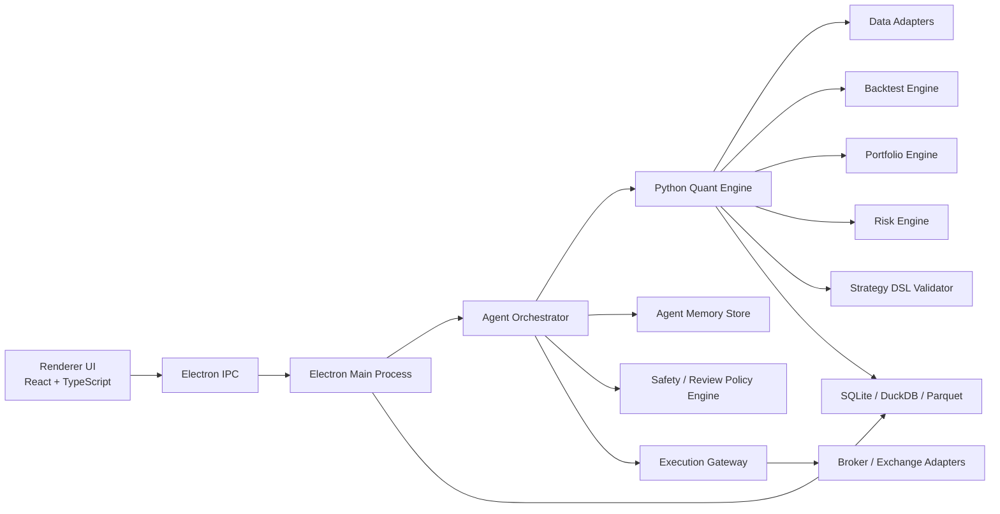
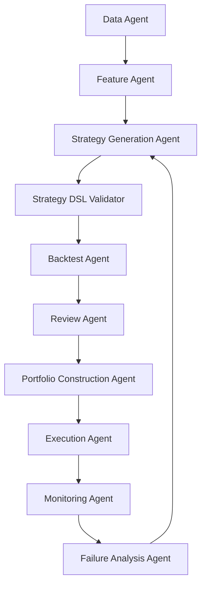

# TradingAPP Architecture

이 문서는 [PRD.md](/Users/lee/Desktop/Project/TradingAPP/develop-plans/PRD.md)와 [ai-agent-feature-recommendations.md](/Users/lee/Desktop/Project/TradingAPP/develop-plans/ai-agent-feature-recommendations.md)를 기준으로 `TradingAPP`의 권장 아키텍처를 정의한다.

이 제품은 일반 차트 앱이 아니라, 개인이 자신의 전략 에이전트를 운영하는 `local-first AI trading operations platform`으로 설계한다. 따라서 구조의 중심도 화면이 아니라 아래 루프를 안정적으로 운영하는 데 있다.

- 데이터 수집
- 전략 생성
- 전략 DSL 검증
- 백테스트 및 워크포워드
- 리스크 심사
- 포트폴리오 구성
- paper/live 실행
- 감시, 중단, 실패 분석

## 1. 아키텍처 목표

- 개인 사용자가 설치 후 바로 실행 가능한 `Electron` 기반 데스크톱 앱
- UI와 계산 엔진이 분리된 구조
- 전략 문서들을 독립 에이전트로 변환할 수 있는 모듈형 구조
- 자동 연구와 자동 운용을 같은 시스템 안에서 처리하는 구조
- 실거래보다 검증과 통제를 우선하는 안전한 구조

## 2. 핵심 설계 원칙

### 2.1. Agent-First

- 모든 핵심 기능은 페이지가 아니라 `agent` 단위로 정의한다.
- 예:
  - `Technical Signal Agent`
  - `Fundamental Ranking Agent`
  - `Macro Regime Agent`
  - `Micro Structure Agent`
  - `Econometric Portfolio & Risk Agent`

### 2.2. Local-First

- 전략 정의, 실험 결과, 에이전트 메모리, 리포트는 로컬 우선 저장한다.
- 외부 연결은 데이터 수집, 모델 호출, 브로커 실행 등 필요 시점에만 사용한다.

### 2.3. Safe-by-Default

- AI가 임의 코드를 실행하지 않는다.
- AI는 제한된 `strategy DSL`만 생성할 수 있다.
- 검증되지 않은 전략은 paper/live 실행 불가다.

### 2.4. Point-in-Time by Default

- 가격 데이터뿐 아니라 재무, 거시, 이벤트 데이터도 시점 정합성을 강제한다.
- `published_at`, `effective_at`, `as_of_date` 없이 전략 계산에 쓰지 않는다.

### 2.5. Composable Strategies

- 기술적, 기본적, 거시, 미시, 계량 전략을 공통 인터페이스 위에서 조합할 수 있어야 한다.
- 조합은 단순 병렬 실행이 아니라 `후보 생성 -> 타이밍 -> 레짐 필터 -> 리스크 제한` 흐름을 지원해야 한다.

### 2.6. Observable Operations

- 모든 생성, 검증, 실행, 중단 이벤트는 추적 가능해야 한다.
- 자동화가 깊어질수록 로그와 설명 가능성이 필수다.

---

## 3. 최상위 시스템 구조



### 상위 컴포넌트 역할

- `Renderer UI`
  - operator가 전략과 에이전트 상태를 관리하는 콘솔
- `Electron Main Process`
  - OS 연동, 프로세스 관리, IPC, 파일 접근
- `Agent Orchestrator`
  - 에이전트 호출 순서와 상태 전이를 관리
- `Python Quant Engine`
  - 데이터 처리, 피처 생성, 전략 실행, 백테스트
- `Safety / Review Policy Engine`
  - 실거래 전 심사와 kill switch 정책 관리
- `Agent Memory Store`
  - 전략 히스토리, 실패 사례, 이전 심사 결과 저장
- `Execution Gateway`
  - paper/live 주문 전환과 브로커 adapter 연결

---

## 4. 멀티 에이전트 아키텍처

`TradingAPP`는 하나의 거대 AI가 모든 판단을 하는 구조보다, 역할이 분리된 에이전트 집합이 더 적합하다.

### 4.1. 권장 에이전트 구성

- `Data Agent`
  - 데이터 수집, 정합성 검증, 캐시 갱신
- `Feature Agent`
  - 가격/재무/거시/미시 피처 계산
- `Strategy Generation Agent`
  - 자연어 목표를 전략 DSL 초안으로 변환
- `Strategy Composer Agent`
  - 단일 전략을 조합 전략으로 확장
- `Backtest Agent`
  - 전략 검증과 성과 계산
- `Review Agent`
  - OOS, MDD, turnover, concentration 등 기준 심사
- `Portfolio Construction Agent`
  - 전략 및 자산 가중치 결정
- `Execution Agent`
  - paper/live 주문 생성과 실행
- `Monitoring Agent`
  - 성과, 리스크, 데이터 피드, 이벤트 감시
- `Failure Analysis Agent`
  - 전략 실패 원인 분석과 재학습 입력 생성

### 4.2. 에이전트 흐름



### 4.3. 왜 이 구조가 필요한가

- 데이터 문제와 전략 문제를 분리할 수 있다.
- 실패 원인을 추적하기 쉽다.
- 각 단계마다 별도 승인 규칙을 둘 수 있다.
- 일부는 자동, 일부는 수동 승인하는 하이브리드 운영이 가능하다.

---

## 5. 프로그램 계층 구조

전체 프로그램은 7개 계층으로 나눈다.

### 5.1. Presentation Layer

- 에이전트 대시보드
- 전략 실험실
- 백테스트 리포트
- 포트폴리오/리스크 모니터
- 승인 및 중단 콘솔

### 5.2. Application Layer

- 유스케이스 실행
- 잡 스케줄링
- 장기 실행 작업 상태 추적
- 요청 검증

### 5.3. Orchestration Layer

- 에이전트 호출 순서 결정
- 상태 전이 관리
- 재시도와 타임아웃
- 의존성 관리

### 5.4. Domain Layer

- 전략 DSL
- 전략 정의
- 리스크 정책
- 포트폴리오 정책
- 심사 정책

### 5.5. Compute Layer

- 피처 계산
- 전략 신호
- 백테스트
- 포트폴리오 최적화
- 통계 및 팩터 분석

### 5.6. Data Layer

- 외부 데이터 수집
- 정규화
- point-in-time 저장
- 캐시
- 품질 검증

### 5.7. Integration Layer

- LLM provider
- 브로커/거래소 adapter
- 뉴스/거시/API provider

---

## 6. 권장 기술 스택

### 6.1. Desktop

- `Electron`
- `React`
- `TypeScript`
- `Vite`

### 6.2. UI State / Contracts

- `Zustand` 또는 `Redux Toolkit`
- `TanStack Query`
- `Zod`

### 6.3. Quant / AI Engine

- `Python 3`
- `pandas`
- `numpy`
- `polars`
- `statsmodels`
- `scikit-learn`
- `PyArrow`

### 6.4. Storage

- `SQLite`
  - 설정, 잡, 에이전트 상태, 승인 로그
- `DuckDB`
  - 시계열, 백테스트, 팩터 분석
- `Parquet`
  - raw cache, feature snapshot, result export

### 6.5. Packaging

- `electron-builder`
- Electron main process 기반 Python subprocess 관리

---

## 7. 디렉터리 아키텍처

```text
/
  .venv/
  develop-plans/
  frontend-examples/
  app/
    data/
    service/
    scripts/
    src/
      main/
      preload/
      renderer/
  etc/
```

### 7.1. `app/src`

- Electron 실행 핵심 코드
- `main`: BrowserWindow/앱 라이프사이클
- `preload`: 안전한 브리지
- `renderer`: React UI

### 7.2. `app/service`

- 백엔드 기능 모듈 확장 위치
- 도메인별로 `service/<domain>/...` 구조 유지

### 7.3. `app/data`

- 실행에 필요한 로컬 데이터 파일 위치
- 런타임 캐시/샘플 데이터/초기 설정 파일 관리

### 7.4. `frontend-examples`

- Electron 반영 전 정적 시안 검증용
- 디자인/레이아웃 실험 공간

---

## 8. 전략 DSL 아키텍처

AI가 직접 코드가 아니라 DSL을 만들도록 강제해야 한다.

### 8.1. DSL이 포함해야 할 요소

- `universe`
- `data_requirements`
- `features`
- `entry_rules`
- `exit_rules`
- `sizing_rules`
- `risk_rules`
- `rebalance`
- `execution_mode`

### 8.2. 예시

```json
{
  "id": "fundamental-momentum-hybrid-v1",
  "universe": "US-largecap",
  "data_requirements": ["price", "fundamentals", "macro"],
  "features": [
    { "name": "quality_score" },
    { "name": "relative_strength_126d" },
    { "name": "macro_risk_on" }
  ],
  "entry_rules": [
    { "if": "quality_score >= p70" },
    { "if": "relative_strength_126d >= p80" },
    { "if": "macro_risk_on == true" }
  ],
  "exit_rules": [
    { "if": "price < ema_200" },
    { "if": "atr_stop_hit == true" }
  ],
  "sizing_rules": {
    "method": "vol_target"
  },
  "risk_rules": {
    "max_position": 0.1,
    "max_sector": 0.25
  },
  "rebalance": "weekly",
  "execution_mode": "paper"
}
```

### 8.3. DSL 처리 흐름

- 자연어 입력
- LLM이 전략 DSL 초안 생성
- schema validation
- 허용된 지표/연산 여부 검사
- execution graph로 컴파일
- 백테스트로 전달

---

## 9. 데이터 아키텍처

### 9.1. Raw Layer

- 공급자 원본 저장
- 재수집과 감사 목적

### 9.2. Normalized Layer

- 가격/재무/거시/이벤트 표준 스키마
- 심볼/통화/거래소/캘린더 통합

### 9.3. Feature Layer

- 기술 지표
- 재무 팩터 점수
- 거시 레짐 신호
- 미시 구조 점수
- 리스크 지표

### 9.4. Result Layer

- 백테스트 결과
- 전략 심사 결과
- 리밸런싱 제안
- monitoring alert
- failure analysis 결과

### 9.5. point-in-time 규칙

- 재무 데이터는 `report_period_end`와 `published_at`을 분리
- 거시 데이터는 수정치와 최초 발표치를 구분
- 백테스트는 당시 가용 데이터만 읽도록 강제

---

## 10. 백테스트 및 심사 아키텍처

자동화 목적에서는 백테스트 자체보다 `백테스트 -> 심사 -> 승인` 파이프라인이 중요하다.

### 10.1. Backtest Engine 구성

- `DataLoader`
- `FeaturePipeline`
- `SignalEngine`
- `ExecutionSimulator`
- `PortfolioBook`
- `MetricsCalculator`
- `ReportGenerator`

### 10.2. Review Engine 구성

- `PerformanceRules`
- `RiskRules`
- `RobustnessRules`
- `DataIntegrityRules`

### 10.3. 최소 심사 항목

- CAGR
- Sharpe
- Sortino
- Max Drawdown
- Turnover
- Alpha / Beta
- OOS 유지력
- 종목 수 및 섹터 편중
- 거래비용 반영 후 성과

### 10.4. 상태 전이

```text
draft -> simulated -> reviewed -> paper -> approved_live -> paused -> retired
```

전략은 심사 통과 전 `approved_live`로 갈 수 없다.

---

## 11. 포트폴리오 및 리스크 아키텍처

### 11.1. Portfolio Engine

- 전략별 점수 합성
- 전략별 가중치
- 자산별 비중
- 현금 비중
- 리밸런싱 계산

### 11.2. Risk Engine

- volatility targeting
- VaR / Expected Shortfall
- max drawdown tracking
- concentration limits
- factor exposure analysis
- correlation spike detection

### 11.3. Risk Guardrail

- 신규 전략 live 차단
- 포지션 감축
- 전략 정지
- kill switch 트리거

---

## 12. 실행 아키텍처

### 12.1. Execution Gateway

- paper/live mode 분리
- pre-trade risk check
- order serialization
- execution log

### 12.2. Broker Adapter 인터페이스

```text
BrokerAdapter
  -> authenticate()
  -> fetch_accounts()
  -> fetch_positions()
  -> fetch_orders()
  -> place_order(order)
  -> cancel_order(order_id)
  -> stream_market_data()
```

### 12.3. 실행 원칙

- 새 전략은 기본적으로 `paper`에서 시작
- 일정 기간 심사 통과 시에만 `live` 승격 후보
- `live` 승격은 operator 승인 필요

---

## 13. 모니터링 및 실패 분석 아키텍처

### 13.1. Monitoring Agent가 감시할 대상

- drawdown breach
- volatility breach
- factor drift
- macro regime shift
- data feed failure
- order failure
- benchmark underperformance persistence

### 13.2. Failure Analysis Agent가 분석할 대상

- 전략 붕괴 원인
- 특정 팩터 과편중
- 데이터 누락 또는 시차 오류
- 거래비용 과소추정
- 레짐 전환 미반영

### 13.3. 결과 활용

- 자동 중단 근거 기록
- 전략 교체 후보 생성
- future strategy generation prompt 개선

---

## 14. UI 아키텍처

UI는 판단을 대신하는 화면이 아니라, 에이전트를 운영하고 승인하는 콘솔이어야 한다.

### 필수 화면

- `Agent Console`
  - 에이전트 상태, 최근 실행, 경고, 실패
- `Strategy Lab`
  - 전략 생성 요청, DSL 보기, 조합 실험
- `Backtest Review`
  - 성과, 심사 결과, OOS 비교
- `Portfolio Monitor`
  - 현재 전략/자산/팩터 노출
- `Risk Center`
  - kill switch, 경고, 이벤트 리스크
- `Approvals`
  - paper/live 승격 승인

---

## 15. 보안과 안전 정책

### 15.1. 권한 제한

- renderer에서 직접 시스템 권한을 갖지 않는다.
- 민감 작업은 main process와 policy engine을 거친다.

### 15.2. 비밀정보 저장

- 브로커 키와 API 키는 OS keychain 또는 암호화 저장소 사용

### 15.3. 실행 제한

- AI는 임의 Python/JS 코드를 실행하지 않는다.
- 허용된 DSL과 허용된 provider만 사용한다.

### 15.4. Kill Switch

- 아래 조건에서는 자동 정지 가능해야 한다.
  - 최대 낙폭 초과
  - 포트폴리오 변동성 초과
  - 주문 실패 연속 발생
  - 데이터 피드 장애
  - 레짐 급변

---

## 16. 단계별 구현 로드맵

### Phase 1. Agent Research Loop

- Data Agent
- Technical Signal Agent
- Strategy DSL Generator
- Backtest Agent
- Review Report

목표:

- AI가 전략을 만들고 검증하는 최소 루프 완성

### Phase 2. Portfolio Loop

- Fundamental Ranking Agent
- Strategy Composer Agent
- Portfolio Engine
- Risk Guardrail

목표:

- 단일 전략을 넘어서 자동 포트폴리오 구성

### Phase 3. Monitoring Loop

- Macro Regime Agent
- Monitoring Agent
- Failure Analysis Agent
- Kill Switch

목표:

- 운영 중 실패를 자동 감지하고 중단

### Phase 4. Controlled Execution

- Execution Gateway
- Broker Adapter
- paper/live 승격 정책

목표:

- 검증된 전략만 제한적으로 자동 실행

## 17. 최종 방향

`TradingAPP`은 전통적인 "차트 + 지표 + 수동 주문" 앱보다, 전략 문서들을 각각 독립 에이전트로 분해하고 그 에이전트들을 `오케스트레이션`, `정책`, `메모리`, `리스크 통제` 위에 올리는 구조가 더 적합하다.

즉 이 아키텍처의 핵심은 단순 분석 툴이 아니라, `생성 -> 검증 -> 실행 -> 감시 -> 중단 -> 재학습` 루프를 장기간 안정적으로 반복할 수 있는 `AI trading operations system`을 만드는 것이다.
